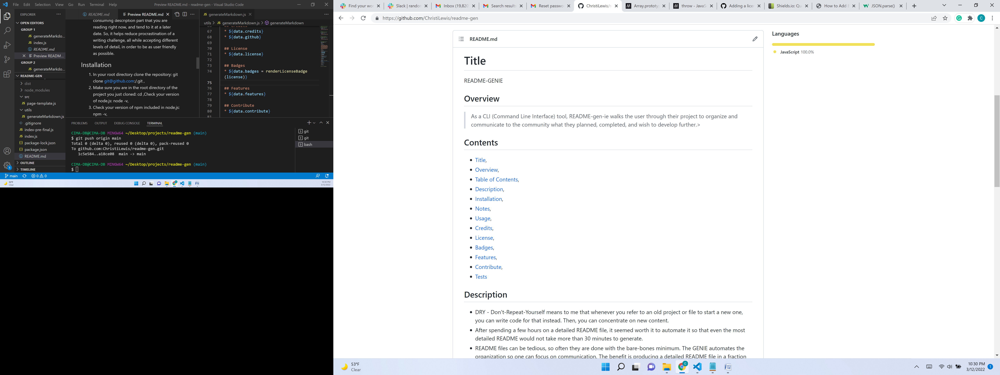

  # Title
  README-GENIE
  
  ## Overview 
  >As a CLI (Command Line Interface) tool, README-GENIE walks the user through their project to organize and communicate to the community what they planned, completed, and wish to develop further.

  <!--GO AHEAD AND MANUALLY FIX THIS MARKDOWN FILE SO THE TABLE OF CONTENTS AND THE INSTALLATION NOTES LOOK LIKE A LIST.  I'M TRYING TO SOLVE PRINTING THE CHOICES ARRAY FROM THE INDEX.JS FILE AS AN OBJECT SO IT LOOKS MORE LIKE A LIST- IS IT A PARSE FUNCTION? FOUND https://www.w3schools.com/js/js_json_parse.asp OR IS IT A STRING  https://developer.mozilla.org/en-US/docs/Web/JavaScript/Reference/Global_Objects/Array/toString-->

  ## Contents
  * [Title](#title),
  * [Overview](#overview),
  * [Table of Contents](#contents),
  * [Description](#description),
  * [Installation](#installation),
  * [Notes](#notes),
  * [Usage](#usage),
  * [Credits](#credits),
  * [License](#license),
  * [Badges](#badges),
  * [Features](#features),
  * [Contribute](#contribute),
  * [Tests](#tests)

  ## Description
  <!--undefined hidden-->
  * DRY - Don't-Repeat-Yourself means to me that whenever you refer to an old project or file to start a new one, you can write code for that instead. Then, you can concentrate on new content.
  * After spending a few hours on a detailed README file, it seemed worth it to automate it so that even the most detailed README would not take more than 30 minutes to generate.
  * README files can be tedious, so often they are done with the bare-bones minimum. The GENIE automates the organization so one can focus on communication. The benefit is producing a detailed README file in a fraction of the time.
  * I learned that I was not alone in procrastinating my README file, so a CLI (Command Line Interface) tool that helps to quickly specify a high quality presentation is a win-win!
  * The best detail of this CLI tool is that if you are really in a bind, you can defer the most time consuming description part that you are reading right now, and tend to it at a later date. So, it helps reduce procrastination of a writing challenge, all while accepting different levels of detail, in order to be as user friendly as possible.

  ## Installation
  <!--* false-->
  1) In your root directory clone the <project directory name> repository: git clone git@github.com:<userName>/<project directory name>.git ,
  2) Make sure you are in the root directory of the project you just cloned: cd <project directory name>,Check your version of node.js: node -v,
  3) Check your version of npm included in node.js: npm -v,
  4) Install a node package manager or npm named inquirer: npm i inquirer,
  5) Install another npm named file system or fs: npm i fs,
  6) Initiate npm: npm init -y,
  7) Verify your npm packages are installed: ls node_modules,
  8) Add a .gitignore file to spare your GitHub repository uploading all npm modules with each commit: touch .gitignore,
  9) Open the .gitignore file and add on line 1: node_modules/,
  10) On line 2 .gitignore file add for mac users: .DS_Store/,
  11) From the command line, run the node.js app: node index.js,
  12) Follow the command line instructions, and after you are happy with your result, uninstall the npm packages to not clog your computer: npm uninstall inquirer,
  13) Unistall the fs package too: npm uninstall fs,
  14) See below for additional notes or alternate installation instructions.
  undefined

  ## Usage
  * 
  * [GitHub Repo](https://github.com/ChristiLewis/readme-gen)
  <!--* true-->
  <!--* false-->
  
  ## Credits
  * [UM Coding Bootcamp](https://bootcamp.miami.edu/coding/)
  * [ChristiLewis](https://github.com/ChristiLewis)

  ## License
  * true
  
  ## Badges
  * ;

  ## Features
  * node.js practice & README file expediting

  ## Contribute
  * true

  ## Tests
  * JEST- TBD

  ## Contact
  * [Contact Me](clc@xxxxxxxx.com)
